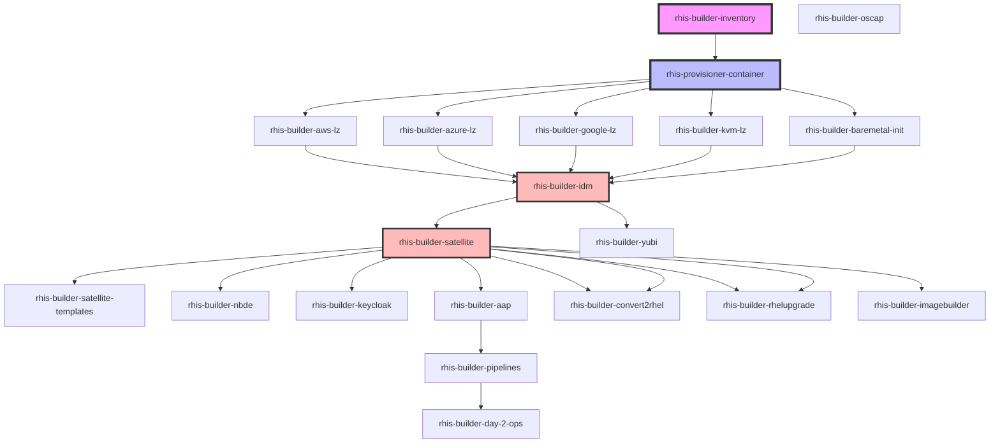

# RHIS Dependencies

**Inter-repository dependencies and relationships**

---

## Dependency Visualization



---

## Dependency Matrix

| Repository | Depends On | Consumed By | Deploy Order |
|------------|------------|-------------|--------------|
| **rhis-builder-inventory** | None | All | N/A (data repo) |
| **rhis-provisioner-container** | inventory + all repos | N/A | N/A (build only) |
| **rhis-builder-aws-lz** | inventory, provisioner | idm | 1 |
| **rhis-builder-azure-lz** | inventory, provisioner | idm | 1 |
| **rhis-builder-google-lz** | inventory, provisioner | idm | 1 |
| **rhis-builder-kvm-lz** | inventory, provisioner | idm | 1 |
| **rhis-builder-baremetal-init** | inventory, provisioner | idm | 1 |
| **rhis-builder-idm** | inventory, provisioner, redhat.rhel_idm | satellite, yubi, all services | 2 |
| **rhis-builder-satellite** | inventory, provisioner, idm | satellite-templates, all services | 3 |
| **rhis-builder-satellite-templates** | satellite | satellite | 3+ |
| **rhis-builder-nbde** | inventory, provisioner, satellite | N/A | 4+ |
| **rhis-builder-keycloak** | inventory, provisioner, satellite, idm | applications | 4+ |
| **rhis-builder-yubi** | inventory, provisioner, idm | N/A | 4+ |
| **rhis-builder-oscap** | inventory, provisioner, satellite | N/A | 4+ |
| **rhis-builder-aap** | inventory, provisioner, satellite, idm | pipelines | 4+ |
| **rhis-builder-pipelines** | inventory, provisioner, aap, day-2-ops | N/A | 5+ |
| **rhis-builder-convert2rhel** | inventory, provisioner, satellite, aap | N/A | 4+ |
| **rhis-builder-rhelupgrade** | inventory, provisioner, satellite | N/A | 4+ |
| **rhis-builder-imagebuilder** | inventory, provisioner, satellite | N/A | 4+ |
| **rhis-builder-day-2-ops** | inventory, provisioner | pipelines | 4+ |

**Deploy Order Legend**:
- 1: Landing zone (creates initial hosts)
- 2: IdM (first service)
- 3: Satellite (second service, universal provisioner)
- 4+: All other services (provisioned via Satellite)
- 5+: Operational services (require other services)

---

## Detailed Dependency Breakdown

### rhis-builder-inventory

**Role**: Keystone repository - single source of truth for all configuration

**Dependencies**: None

**Consumed By**: All other repositories

**Consumption Method**:
- Mounted into rhis-provisioner-container at runtime
- All projects reference via symlinks to common vars directory

**Critical Files**:
- `group_vars/` - Group-level variables
- `host_vars/` - Host-specific configuration
- `templates/` - Jinja2 templates
- `vault/` - Encrypted secrets (Ansible Vault)
- `inventory/` - Ansible inventory files
- `inventory_template/` - Template for generating new deployments

---

### rhis-provisioner-container

**Role**: Unified execution environment containing all RHIS components

**Dependencies**: 
- rhis-builder-inventory (mounted at runtime)
- All 25 rhis-builder-* repositories (cloned at build time)
- RHEL UBI 9 base image
- Python packages (via pip)
- Ansible core + collections

**Consumed By**: Human operators (not automated dependencies)

**Build-Time Dependencies**:
```dockerfile
# External dependencies
FROM quay.io/parmstro/rhis-base-9-2.5:latest

# Git repositories cloned during build
RUN git clone https://github.com/parmstro/rhis-builder-inventory
RUN git clone https://github.com/parmstro/rhis-builder-idm
# ... all 25 repos
```

**Runtime Dependencies**:
```bash
# Inventory mounted at runtime
podman run -v /path/to/inventory:/opt/rhis/inventory:Z rhis-provisioner-9:latest
```

---

### Landing Zones (5 repositories)

**Purpose**: Create minimal RHEL 9 hosts for IdM and Satellite

**Dependencies**:
- rhis-builder-inventory (configuration)
- rhis-provisioner-container (execution environment)
- Cloud/platform credentials (from vault)
- Platform-specific Ansible collections:
  - AWS: `amazon.aws`
  - Azure: `azure.azcollection`
  - GCP: `google.cloud`
  - KVM: `community.libvirt`

**Consumed By**: rhis-builder-idm (runs on created hosts)

**Output**:
- Minimal RHEL 9 host for IdM primary
- Minimal RHEL 9 host for Satellite primary
- Network configuration
- Initial credentials

**Deployment Order**: #1 (first step)

---

### rhis-builder-idm

**Purpose**: Red Hat Identity Management primary server

**Dependencies**:
- Landing zone output (hosts)
- rhis-builder-inventory (configuration)
- `redhat.rhel_idm` Ansible collection
- RHEL subscriptions

**Consumed By**:
- rhis-builder-satellite (IdM client)
- rhis-builder-yubi (YubiKey integration)
- All services (authentication, DNS, certificates)

**Provides**:
- Authentication (Kerberos, LDAP)
- Authorization (groups, sudo rules)
- DNS (forward and reverse zones)
- Certificate Authority (PKI)
- Dynamic DNS updates

**Critical Services**:
- krb5kdc (Kerberos)
- named (DNS)
- httpd (web UI, API)
- 389-ds (LDAP directory)
- dogtag (CA)

**Deployment Order**: #2 (immediately after landing zone)

**Integration Points**:
```yaml
# Satellite depends on IdM for:
- Authentication (realm-capsule user)
- DNS (dynamic updates)
- Certificates (HTTP service principal)

# All services depend on IdM for:
- User authentication
- Host enrollment
- DNS resolution
- TLS certificates
```

---

### rhis-builder-satellite

**Purpose**: Universal provisioner for all RHIS infrastructure

**Dependencies**:
- rhis-builder-idm (must be deployed and functional)
- rhis-builder-inventory (configuration)
- RHEL subscriptions
- Satellite manifest (entitlements)

**Consumed By**:
- rhis-builder-satellite-templates (template sync)
- All infrastructure services (provisioning)

**Provides**:
- Provisioning (bare metal, VMs, cloud instances)
- Content management (RPM repos, container images)
- Configuration management (hostgroups, compute profiles)
- Lifecycle management (content views, environments)
- Subscription management

**IdM Integration**:
```bash
# During Satellite deployment:
1. ipa-client-install (register as IdM client)
2. foreman-prepare-realm (create realm-capsule user)
3. ipa service-add HTTP/satellite.example.ca (service principal)
4. ipa-getcert request (obtain certificates)
```

**Provisioning Capabilities**:
- **Compute Resources**: KVM, VMware, AWS, Azure, GCP
- **Compute Profiles**: Small, Medium, Large (customizable)
- **Hostgroups**: One per rhis-builder-* system type

**Deployment Order**: #3 (after IdM)

**Post-Deployment Role**:
All subsequent infrastructure provisioned through Satellite:
```yaml
# Provisioning workflow
1. Select hostgroup (e.g., "RHIS NBDE Server")
2. Choose compute resource (e.g., AWS us-east-1)
3. Select compute profile (e.g., "Medium")
4. Provision → Satellite creates instance
5. Kickstart → RHEL installed
6. Auto-enroll → Joins IdM realm
7. Configuration → Ansible applies role
```

---

### rhis-builder-satellite-templates

**Purpose**: GitOps for Satellite provisioning templates

**Dependencies**:
- rhis-builder-satellite (must be deployed)
- Git repository access
- Satellite API credentials

**Consumed By**: rhis-builder-satellite (templates imported)

**Template Types**:
- Provisioning templates (kickstart, cloud-init)
- Partition tables
- PXE boot templates
- Job templates
- Report templates

**Sync Mechanism**:
```ruby
# ERB template metadata parsed by Satellite
<%#
kind: provision
name: RHIS RHEL 9 Kickstart
model: ProvisioningTemplate
oses:
- RedHat 9
%>
```

**GitOps Flow**:
```
Git commit → Template sync job → Satellite imports → Available for provisioning
```

---

### Security Services

#### rhis-builder-nbde

**Dependencies**:
- Satellite (for provisioning Tang servers)
- rhis-builder-inventory (container configs, client bindings)
- Podman (for Tang containers)
- `containers.podman` collection
- `rhel-system-roles.nbde_client` collection

**Consumed By**: Encrypted RHEL systems (clients)

**Provides**:
- Tang key servers (in containers)
- Automated disk decryption at boot
- Network-bound encryption

**Architecture**:
```
Tang Server (container) ←→ Clevis Client (boot)
     ↓                           ↓
  Keys in volume            Encrypted disk unlocks
```

**Deployment Order**: 4+ (after Satellite)

#### rhis-builder-keycloak

**Dependencies**:
- Satellite (provisioning)
- rhis-builder-idm (identity backend)
- Database (PostgreSQL)

**Consumed By**: Applications requiring SSO

**Provides**:
- Identity brokering (SAML, OAuth, OIDC)
- Federation with IdM
- Application SSO

**Integration**:
```
Application → Keycloak → IdM → LDAP/Kerberos
```

#### rhis-builder-yubi

**Dependencies**:
- rhis-builder-idm (YubiKey enrolled here)
- YubiKey hardware tokens

**Consumed By**: Users requiring 2FA

**Provides**:
- Hardware token 2FA
- OTP and U2F support

**Integration**:
```
User login → IdM checks → YubiKey validation → Access granted
```

#### rhis-builder-oscap

**Dependencies**:
- Satellite (for provisioning and scanning)
- OpenSCAP packages
- SCAP content (CIS benchmarks)

**Consumed By**: Compliance reporting

**Provides**:
- Security compliance scanning
- CIS RHEL 9 hardening
- Remediation automation

---

### Automation Services

#### rhis-builder-aap

**Dependencies**:
- Satellite (provisioning)
- rhis-builder-idm (authentication)
- AAP installation media
- AAP subscriptions

**Consumed By**: rhis-builder-pipelines

**Provides**:
- Centralized automation execution
- Job scheduling
- Credential management
- RBAC for automation

**Integration with RHIS**:
```yaml
# AAP projects point to rhis-builder-* git repos
# Inventories sync from Satellite
# Credentials from AAP vault (can integrate IdM)
```

#### rhis-builder-pipelines

**Dependencies**:
- rhis-builder-aap (execution platform)
- rhis-builder-day-2-ops (many roles)
- Satellite API access
- VMware/cloud APIs

**Provides**:
- CI/CD workflows
- Application deployment pipelines
- Operational automation

**Common Workflows**:
- VM provisioning via Satellite
- Application deployment
- Configuration updates
- Compliance checks

---

### Lifecycle Services

#### rhis-builder-convert2rhel

**Dependencies**:
- Satellite (subscription management)
- AAP (orchestration)
- convert2rhel packages
- RHEL subscriptions

**Provides**:
- CentOS → RHEL conversion
- Oracle Linux → RHEL conversion
- Pre-conversion analysis

**Workflow**:
```
1. AAP job template triggers playbook
2. Pre-conversion checks run
3. convert2rhel executes
4. System registers to Satellite
5. Post-conversion validation
```

#### rhis-builder-rhelupgrade

**Dependencies**:
- Satellite
- leapp packages
- RHEL subscriptions

**Provides**:
- RHEL 7 → 8 upgrades
- RHEL 8 → 9 upgrades
- Pre-upgrade checks

**Often Combined**: convert2rhel + upgrade for CentOS 7 → RHEL 9

#### rhis-builder-imagebuilder

**Dependencies**:
- Satellite (provisioning, integration)
- Image Builder (composer) packages

**Provides**:
- Custom RHEL images
- Hypervisor formats (qcow2, vmdk)
- Cloud formats (AMI, VHD, GCE)

**Integration**:
```
ImageBuilder → Builds image → Uploads to Satellite → Available as compute resource
```

#### rhis-builder-day-2-ops

**Dependencies**:
- rhis-builder-inventory (operational configs)
- Various system tools

**Consumed By**: rhis-builder-pipelines

**Provides**:
- Patching playbooks
- Backup/restore roles
- Monitoring setup
- Log management
- Operational utilities

---

## External Dependencies

### Ansible Collections

Required collections across all RHIS projects:

```yaml
---
collections:
  # Core collections
  - ansible.posix
  - ansible.utils
  - community.general
  
  # Red Hat collections
  - redhat.rhel_idm
  - redhat.satellite
  - redhat.rhel_system_roles
  
  # Container management
  - containers.podman
  
  # Cloud platforms
  - amazon.aws
  - azure.azcollection
  - google.cloud
  - community.vmware
  
  # Additional
  - community.libvirt
  - community.crypto
```

### Red Hat Products

- Red Hat Identity Management (IdM)
- Red Hat Satellite
- Red Hat Ansible Automation Platform
- Red Hat Enterprise Linux 8.x, 9.x

### Python Packages

(Baked into rhis-base container):
- ansible-core
- boto3 (AWS)
- azure-cli (Azure)
- google-auth (GCP)
- pyvmomi (VMware)
- Various automation utilities

---

## Dependency Management

### Version Pinning

**Container Images**:
```
quay.io/parmstro/rhis-base-9-2.5:latest
quay.io/parmstro/rhis-provisioner-9:latest
```

**Ansible Collections**:
- Specified in `requirements.yml` per project
- Installed during container build

**Git Repositories**:
- Cloned at specific commits/tags during container build
- Version manifest maintained

### Testing Compatibility

**Recommended**:
1. Test full stack together before container build
2. Pin tested versions in container
3. Version container image with tested component manifest
4. Document tested combinations

**Example Manifest**:
```yaml
rhis_stack_version: "2.5.0"
base_image: "rhel-ubi-9.2"
components:
  rhis-builder-idm: "v1.2.0"
  rhis-builder-satellite: "v1.5.0"
  rhis-builder-nbde: "v1.0.0"
  # ... all components
collections:
  redhat.rhel_idm: "1.10.0"
  redhat.satellite: "3.12.0"
  # ... all collections
```

---

## Circular Dependencies

**None Identified**: The architecture follows a strict layered approach:

```
Layer 1 (Landing Zones) → Layer 2 (IdM) → Layer 3 (Satellite) → Layer 4+ (Services)
```

No service depends on a service deployed later.

---

## Recommended Dependency Management Practices

1. **Version Lock Files**: Create lock files for tested component combinations
2. **Integration Testing**: Test full stack before building provisioner container
3. **Semantic Versioning**: Use semver for all repos (vMAJOR.MINOR.PATCH)
4. **Change Management**: Document breaking changes in CHANGELOG.md
5. **Deprecation Warnings**: Warn users before removing features (like NBDE variable renaming)

---

**Last Updated**: 2026-04-29  
**Maintained By**: parmstro
