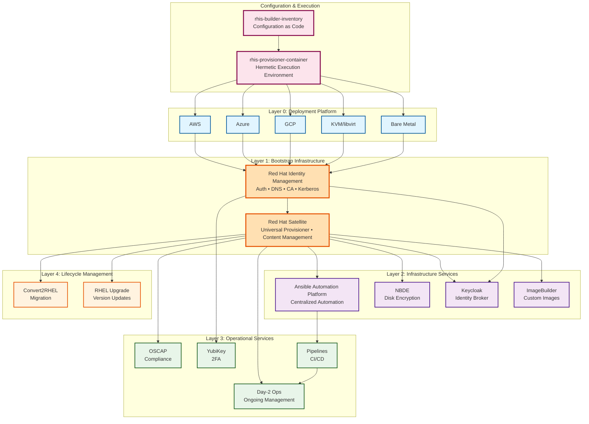

# RHIS High-Level Architecture

## Overview Diagram

## Key Characteristics

- **Multi-Cloud Native**: Single platform for AWS, Azure, GCP, KVM, Bare Metal
- **Identity-First**: All services integrate with IdM for auth, DNS, certificates
- **Satellite-Driven**: Universal provisioner for all infrastructure after bootstrap
- **Hermetic Packaging**: Complete platform in one container for air-gap deployment
- **Configuration as Code**: Single source of truth in rhis-builder-inventory

## Deployment Order

1. **Landing Zone** (Layer 0) → Creates minimal RHEL hosts
2. **IdM** (Layer 1) → Identity, DNS, CA - **FIRST SERVICE**
3. **Satellite** (Layer 1) → Universal provisioner - **SECOND SERVICE**
4. **All Other Services** (Layers 2-4) → Provisioned via Satellite

---

**Last Updated**: 2026-04-29
