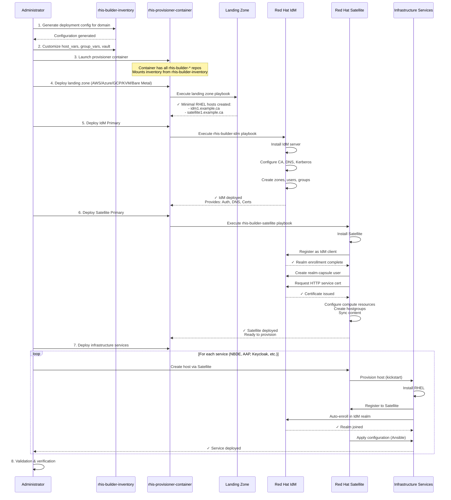

# RHIS Deployment Flow

## Complete Deployment Sequence

## Phase Breakdown

### Phase 0: Preparation (Manual)
- Obtain RHEL subscriptions
- Obtain Satellite manifest
- Set up cloud credentials (if needed)
- Clone rhis-builder-inventory
- Generate domain configuration
- Customize variables and vault

**Duration**: 1-4 hours

### Phase 1: Landing Zone (Automated)
- Create VPC/network (cloud) or configure network (on-prem)
- Provision minimal RHEL 9 hosts for IdM and Satellite
- Configure initial access (SSH keys, security groups)

**Duration**: 15-30 minutes

### Phase 2: Deploy IdM (Automated)
- Install IdM server packages
- Run ipa-server-install with CA and DNS
- Configure firewall and SELinux
- Create DNS zones (forward and reverse)
- Set up initial users, groups, sudo rules

**Duration**: 15-30 minutes

### Phase 3: Deploy Satellite (Automated)
- Install Satellite server
- Register as IdM client
- Configure realm integration (foreman-prepare-realm)
- Request certificates from IdM CA
- Configure compute resources for all platforms
- Create compute profiles (Small, Medium, Large)
- Define hostgroups for each system type
- Import provisioning templates from git
- Upload manifest and sync content

**Duration**: 30-60 minutes

### Phase 4: Deploy Services (Automated, Parallel)
For each service:
1. Select hostgroup in Satellite
2. Choose compute resource and profile
3. Provision (Satellite handles kickstart, registration, enrollment)
4. Apply configuration via Ansible

**Duration**: 10-20 minutes per service (can run in parallel)

## Total Deployment Time

- **Minimum** (small environment, experienced admin): 2-3 hours
- **Typical** (standard environment): 4-6 hours
- **Large** (multiple sites, many services): 1-2 days

## Success Criteria

After deployment:
- ✅ IdM web UI accessible (https://idm1.example.ca)
- ✅ Satellite web UI accessible (https://satellite1.example.ca)
- ✅ DNS resolution working via IdM
- ✅ Kerberos authentication functional
- ✅ Satellite can provision new hosts
- ✅ All services registered in IdM
- ✅ All services managed by Satellite

---

**Last Updated**: 2026-04-29
