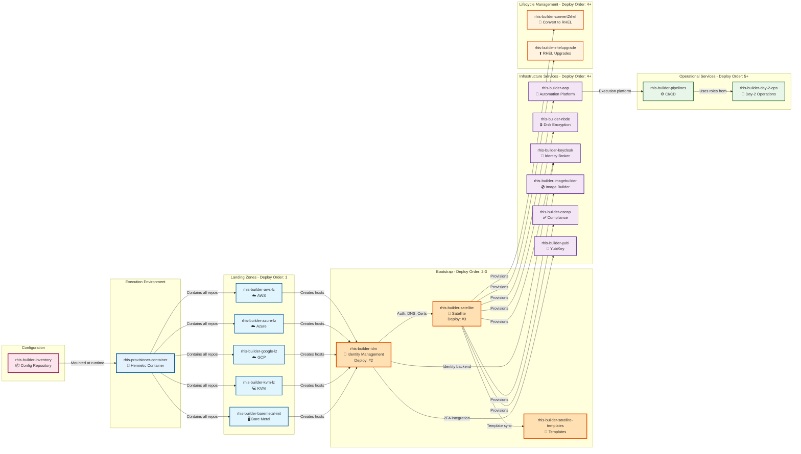

# RHIS Dependency Graph

## Repository Dependencies



## Dependency Types

### Build-Time Dependencies
- **rhis-provisioner-container** clones all 25 repositories during build
- No runtime fetching of code

### Runtime Dependencies
- **rhis-builder-inventory** mounted into container at runtime
- All playbooks reference inventory via symlinked common vars

### External Dependencies

#### Ansible Collections
```yaml
# Core
- ansible.posix
- ansible.utils
- community.general

# Red Hat
- redhat.rhel_idm
- redhat.satellite
- redhat.rhel_system_roles

# Containers
- containers.podman

# Cloud
- amazon.aws
- azure.azcollection
- google.cloud
- community.vmware
```

#### Red Hat Products
- Red Hat Identity Management (IdM)
- Red Hat Satellite
- Red Hat Ansible Automation Platform
- Red Hat Enterprise Linux 8.x, 9.x

## Critical Path

The critical deployment path (cannot be parallelized):

```
Landing Zone → IdM → Satellite → Services
```

**Minimum deployment time**: ~1-2 hours for critical path

After Satellite is deployed, all other services can be provisioned in parallel.

---

**Last Updated**: 2026-04-29
