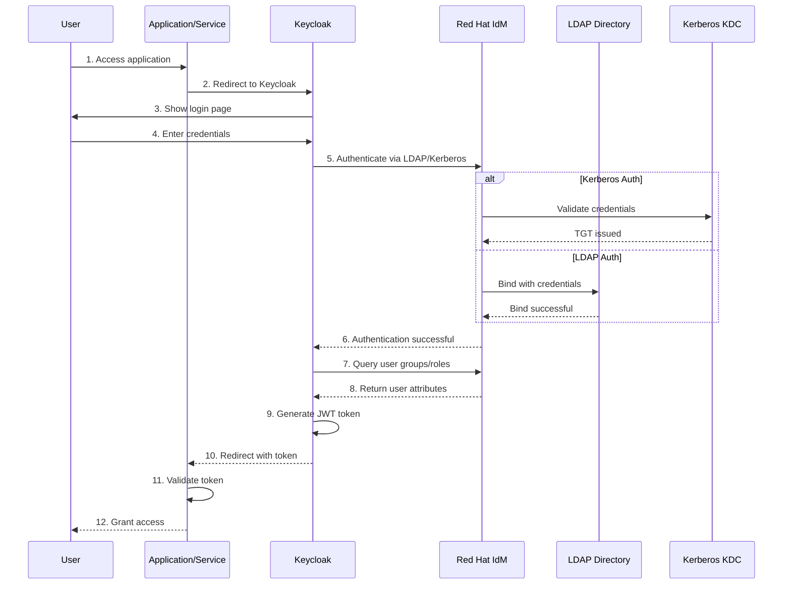
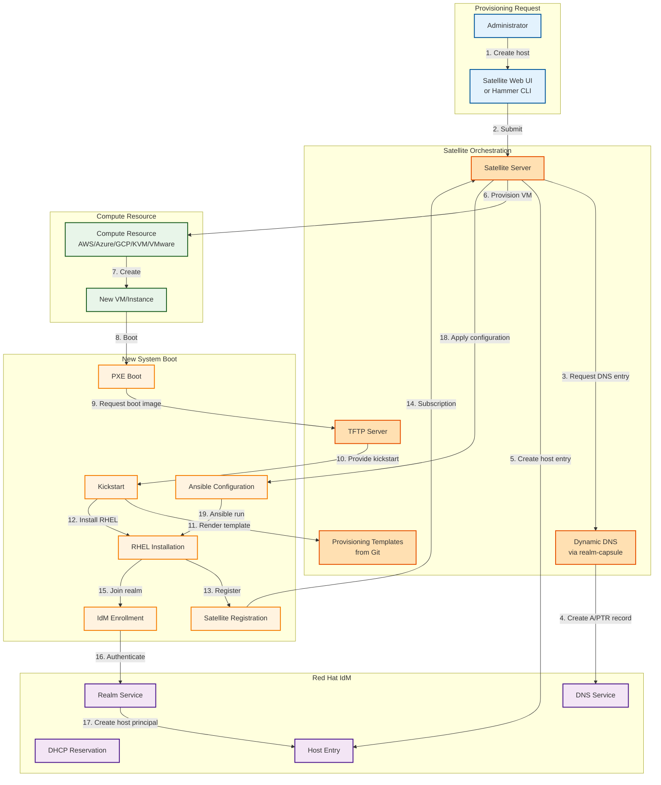

# RHIS Integration and Data Flow

## Identity and Authentication Flow



## Provisioning Flow



## Service Integration Map

```mermaid
graph TB
    subgraph "Identity Layer"
        IDM[Red Hat IdM<br/>🔐]
        KC[Keycloak<br/>🎫]
        YUBI[YubiKey<br/>🔑]
    end

    subgraph "Management Layer"
        SAT[Satellite<br/>📡]
        AAP[Automation Platform<br/>🤖]
    end

    subgraph "Security Layer"
        NBDE[NBDE/Tang<br/>🔒]
        OSCAP[OSCAP<br/>✅]
    end

    subgraph "Application Layer"
        APP1[Application 1]
        APP2[Application 2]
        APP3[Application 3]
    end

    subgraph "Infrastructure Layer"
        HOST1[Host 1]
        HOST2[Host 2]
        HOST3[Host 3]
    end

    %% Identity integrations
    IDM -->|LDAP/Kerberos| SAT
    IDM -->|Identity Backend| KC
    IDM -->|2FA Integration| YUBI
    IDM -->|DNS Resolution| SAT
    IDM -->|DNS Resolution| AAP
    IDM -->|Certificates| SAT
    IDM -->|Certificates| AAP

    %% Management integrations
    SAT -->|Provisions| HOST1
    SAT -->|Provisions| HOST2
    SAT -->|Provisions| HOST3
    SAT -->|Content/Patches| HOST1
    SAT -->|Content/Patches| HOST2
    SAT -->|Content/Patches| HOST3
    
    AAP -->|Configures| HOST1
    AAP -->|Configures| HOST2
    AAP -->|Configures| HOST3
    AAP -->|Deploys| APP1
    AAP -->|Deploys| APP2
    AAP -->|Deploys| APP3

    %% Security integrations
    NBDE -->|Encrypts Disks| HOST1
    NBDE -->|Encrypts Disks| HOST2
    NBDE -->|Encrypts Disks| HOST3
    
    OSCAP -->|Scans| HOST1
    OSCAP -->|Scans| HOST2
    OSCAP -->|Scans| HOST3
    OSCAP -->|Reports to| SAT

    %% Application integrations
    KC -->|SSO| APP1
    KC -->|SSO| APP2
    KC -->|SSO| APP3
    
    APP1 -->|Runs on| HOST1
    APP2 -->|Runs on| HOST2
    APP3 -->|Runs on| HOST3

    %% Host identity
    HOST1 -->|Enrolled in| IDM
    HOST2 -->|Enrolled in| IDM
    HOST3 -->|Enrolled in| IDM

    %% Styling
    classDef identity fill:#f3e5f5,stroke:#4a148c,stroke-width:2px
    classDef management fill:#ffe0b2,stroke:#e65100,stroke-width:2px
    classDef security fill:#e8f5e9,stroke:#1b5e20,stroke-width:2px
    classDef application fill:#e3f2fd,stroke:#01579b,stroke-width:2px
    classDef infrastructure fill:#fff3e0,stroke:#f57c00,stroke-width:2px

    class IDM,KC,YUBI identity
    class SAT,AAP management
    class NBDE,OSCAP security
    class APP1,APP2,APP3 application
    class HOST1,HOST2,HOST3 infrastructure
```



## Data Persistence

### Configuration Data
```
rhis-builder-inventory (Git)
  ├── host_vars/           → Host-specific config
  ├── group_vars/          → Group config
  ├── templates/           → Jinja2 templates
  └── vault/               → Encrypted secrets

Mounted into: rhis-provisioner-container
```

### Identity Data
```
Red Hat IdM (389 Directory Server)
  ├── Users and Groups     → LDAP directory
  ├── DNS Zones            → BIND backend
  ├── Certificates         → Dogtag CA
  ├── Kerberos Principals  → KDC database
  └── Sudo Rules           → LDAP entries

Replicated to: IdM replicas (multi-master)
Backed up via: ipa-backup
```

### Infrastructure Data
```
Red Hat Satellite (PostgreSQL)
  ├── Hosts                → Inventory
  ├── Content Views        → Package metadata
  ├── Activation Keys      → Subscription data
  ├── Provisioning Config  → Templates, profiles
  └── Reports              → Audit logs

Backed up via: satellite-maintain backup
Content stored: /var/lib/pulp (separate volume)
```

### Automation Data
```
Ansible Automation Platform (PostgreSQL)
  ├── Job Templates        → Automation definitions
  ├── Inventories          → Host lists (synced from Satellite)
  ├── Credentials          → Encrypted secrets
  ├── Projects             → Git repo references
  └── Job History          → Execution logs

Backed up via: Database dumps + project configs
```

## Network Communication Patterns

### Management Traffic
```
Administrator → Satellite (443/tcp)
Administrator → IdM (443/tcp)
Administrator → AAP (443/tcp)
```

### Provisioning Traffic
```
New Host → Satellite TFTP (69/udp)
New Host → Satellite HTTP (80/tcp)
New Host → Satellite HTTPS (443/tcp)
```

### Identity Traffic
```
Service → IdM LDAP (389/tcp, 636/tcp)
Service → IdM Kerberos (88/tcp, 88/udp)
Service → IdM DNS (53/tcp, 53/udp)
```

### Automation Traffic
```
AAP → Target Hosts SSH (22/tcp)
Satellite → Target Hosts SSH (22/tcp)
```

### Security Traffic
```
Clevis Client → Tang Server (8080/tcp)
OSCAP Scanner → Target Hosts SSH (22/tcp)
```

---

**Last Updated**: 2026-04-29
